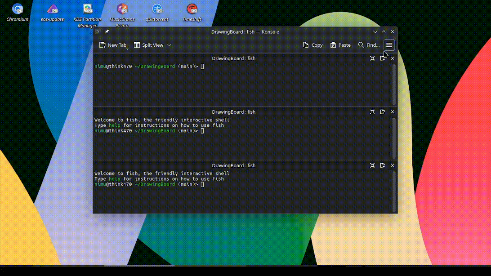

# Networked Drawing Board 🎨

A real-time collaborative drawing application using Java UDP networking, allowing multiple users to draw on a shared canvas simultaneously.

 *(replace with actual demo gif if available)*

## Features ✨
- **Real-time sync** of drawings across all clients
- **Shape tools**: Line, Circle, Rectangle
- **Perfect shapes**: Hold `SHIFT` while drawing for squares/circles
- **Clear board** (affects all clients)
- **Late-join support**: New clients receive existing drawings
- **Network resilience**: Handles client disconnections gracefully

## Technical Stack 💻
- **Language**: Java 11+
- **Networking**: UDP (DatagramSocket)
- **GUI**: Java Swing
- **Protocol**: Custom text-based over UDP
- **Dependencies**: Pure Java (no external libraries)

## File Structure 📁
```
DrawingBoard/
├── src/
│   ├── Server.java            # UDP server (port 5000)
│   ├── DrawingGUI.java        # Main client GUI
│   └── ClientNetworkHandler.java # Network manager
├── bin/                       # Compiled classes
├── README.md                  # This file
└── .gitignore
```

## Installation & Setup ⚙️

### Prerequisites
- Java JDK 11+
- Git (optional)

### 1. Clone the repository
```bash
git clone https://github.com/yourusername/DrawingBoard.git
cd DrawingBoard
```

### 2. Compile the project
```bash
javac src/*.java -d bin/
```

## How to Run 🚀

### Start the Server (Terminal 1)
```bash
java -cp bin/ Server
```
*Output:* `Server running on port 5000`

### Launch Clients (Separate Terminals)
```bash
# Client 1 (auto port)
java -cp bin/ DrawingGUI

# Client 2 (specific port)
java -cp bin/ DrawingGUI 5001
```

## Usage Guide 🖌️

### Drawing Tools
| Button      | Action                          | Keyboard Shortcut |
|-------------|---------------------------------|-------------------|
| Line        | Click-drag to draw              | -                 |
| Circle      | Click-drag from center          | Hold `SHIFT` for perfect circle |
| Rectangle   | Click-drag for dimensions       | Hold `SHIFT` for square |
| Clear Board | Resets all canvases             | -                 |

### Network Protocol
Commands are sent as UDP strings:
```
LINE:x1,y1,x2,y2
CIRCLE:centerX,centerY,radius
RECT:x,y,width,height
CLEAR
```

## Troubleshooting 🔧
| Issue                  | Solution                          |
|------------------------|-----------------------------------|
| "Address in use"       | Change port or kill old Java process |
| Shapes not syncing     | Verify server is running          |
| GUI not responding     | Check for unhandled exceptions    |
| Laggy drawing          | Reduce network traffic           |

## License 📄
MIT License - See [LICENSE](LICENSE) for details
